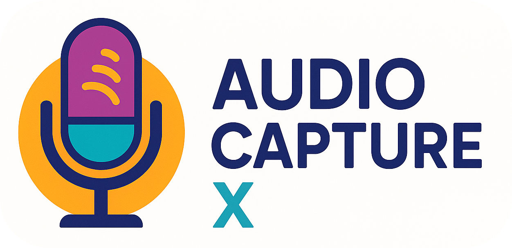

<p align="center">
    <a href="https://github.com/paulocoutinhox/audio-capturex" target="_blank" rel="noopener noreferrer">
        
    </a>
</p>

# Audio Capture X

A cross-platform audio capture library using Mozilla Cubeb.

[](https://github.com/paulocoutinhox/audio-capturex/actions/workflows/build.yml)

## Description

This project provides a modern C++ library for capturing audio input (microphone) across different platforms. The library offers a clean API with background audio capture, callback-based data handling, and thread-safe operations. Other applications can easily integrate this library to capture audio input with minimal setup.

## Features

- **Cross-platform**: Works on macOS, Linux, and Windows
- **Background capture**: Audio capture runs in background thread
- **Callback-based**: Receive audio data through callback functions
- **Thread-safe**: Safe for use in multi-threaded applications
- **Device management**: List and select input devices with interactive selection
- **WAV Recording**: Save captured audio as WAV files with proper headers
- **Clean API**: Easy to integrate into other applications
- **Vendor Libraries**: Organized vendor dependencies (cubeb, drwav)
- **Makefile**: Includes commands for formatting, build, and execution
- **CMake**: Modern and configurable build system

## Prerequisites

### macOS
- Xcode Command Line Tools
- CMake 3.20+
- Make

### Linux
- build-essential
- cmake
- libpulse-dev (optional, for PulseAudio support)
- clang-format (optional, for code formatting)

### Windows
- Visual Studio 2019+ or MinGW
- CMake 3.20+

## Installation

### Install dependencies (Ubuntu/Debian)
```bash
make install-deps
```

### Install dependencies (macOS)
```bash
brew install cmake git clang-format
```

## Usage

### Build the project
```bash
make build
```

### Run the sample application
```bash
make run
```

The sample application provides simple terminal commands:
- **start** - Start audio capture with interactive device selection
- **stop** - Stop capture and save audio as WAV file
- **devices** - List available audio devices
- **status** - Show current status
- **help** - Show all commands
- **quit** - Exit program

### Device Selection

When you run `start`, the application will:
1. Display all available input devices with numbers
2. Allow you to select a specific device by number
3. Use the default device if you press Enter
4. Show which device is being used for capture


### Build in debug mode
```bash
make debug
```

### Build in release mode
```bash
make release
```

### Format code
```bash
make format
```

### Check formatting
```bash
make check-format
```

### Clean build
```bash
make clean
```

### Show help
```bash
make help
```

## Project Structure

```
audio-capturex/
├── CMakeLists.txt          # CMake configuration
├── include/                # Header files
│   └── audio_capture.hpp   # Library header file
├── src/                    # Source files
│   ├── audio_capture.cpp   # Library implementation
│   └── main.cpp            # Sample application with interactive menu
├── vendor/                 # Vendor dependencies
│   ├── cubeb/              # Mozilla Cubeb configuration
│   │   └── CMakeLists.txt  # Cubeb CMake setup
│   └── drwav/              # drwav library
│       ├── dr_wav.h        # drwav header-only library
│       └── CMakeLists.txt  # drwav CMake setup
├── Makefile                # Build and formatting commands
├── README.md               # This file
└── build/                  # Build directory (generated)
    ├── bin/                # Executables
    └── lib/                # Libraries
```

## How It Works

The library provides a simple API for audio capture:

1. **Initialize**: Create an `AudioCapture` instance with a callback function
2. **Start**: Call `startCapture(deviceIndex)` to begin audio capture in background (deviceIndex is optional, -1 for default)
3. **Process**: Audio data is delivered to your callback function
4. **Stop**: Call `stopCapture()` to stop audio capture

### Basic Usage

```cpp
#include "audio_capture.hpp"
#include <iostream>
#include <thread>
#include <chrono>

using namespace AudioCaptureX;

void onAudioData(const std::vector<float>& audioData, int frameCount, int sampleRate, int channelCount) {
    // Process your audio data here
    std::cout << "Received " << frameCount << " frames of audio" << std::endl;
}

int main() {
    // Create audio capture with callback
    AudioCapture capture(onAudioData);

    // Set output file for WAV recording
    capture.setOutputFile("my_recording.wav");

    // Start capture in background thread
    if (capture.startCapture()) {  // Use default device (deviceIndex = -1)
        std::cout << "Audio capture started in background!" << std::endl;

        // Do other work while audio is being captured in background...
        std::cout << "Doing other work while audio captures..." << std::endl;

        // Simulate some work
        for (int i = 0; i < 10; ++i) {
            std::this_thread::sleep_for(std::chrono::seconds(1));
            std::cout << "Working... " << (i + 1) << "/10" << std::endl;
        }

        // Stop capture and save as WAV
        capture.stopCapture();
        capture.saveRecordedAudio();  // Saves as WAV file
        std::cout << "Audio capture stopped and saved!" << std::endl;
    }

    return 0;
}
```

### Device Selection

```cpp
// List available devices
auto devices = capture.getAvailableInputDevices();
for (size_t i = 0; i < devices.size(); ++i) {
    std::cout << i << ": " << devices[i] << std::endl;
}

// Start capture with specific device
if (capture.startCapture(1)) {  // Use device index 1
    std::cout << "Using device: " << capture.getCurrentInputDevice() << std::endl;
}
```

### Advanced Features

- **Device Selection**: List and select specific input devices with interactive selection
- **WAV Recording**: Save captured audio as WAV files with proper headers
- **Thread Safety**: Safe to use from multiple threads
- **Background Processing**: Audio capture runs in background thread
- **Real-time Data**: Audio data delivered through callbacks
- **Cross-platform**: Works on macOS, Linux, and Windows

## Dependencies

- **Mozilla Cubeb**: Cross-platform audio library
  - Repository: https://github.com/mozilla/cubeb
  - Uses FetchContent for automatic download
  - Managed in `vendor/cubeb/CMakeLists.txt`

- **drwav**: Header-only WAV file library
  - Repository: https://github.com/mackron/dr_libs
  - Used for WAV file generation
  - Managed in `vendor/drwav/CMakeLists.txt`

## Supported Platforms

- **macOS**: CoreAudio
- **Linux**: ALSA, PulseAudio (optional)
- **Windows**: WASAPI

## Troubleshooting

### Linking error on macOS
If you encounter linking errors related to CoreFoundation, make sure Xcode Command Line Tools are installed:
```bash
xcode-select --install
```

### PulseAudio error on Linux
Install PulseAudio development:
```bash
sudo apt-get install libpulse-dev
```

### Audio permission issues
On Linux, you may need to add your user to the audio group:
```bash
sudo usermod -a -G audio $USER
```

## License

This project is licensed under the MIT License. However, please note that the Mozilla Cubeb library (used as a dependency) has its own separate license terms. Please refer to the Cubeb repository for its specific licensing information.
